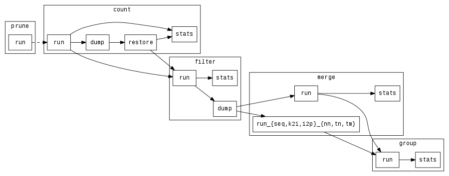

# smufin: Mutation Finder and Genome Comparison Tool

*smufin* is a mutation finder and side-by-side genome comparison and
manipulation toolset based on k-mers. It's both the current reference
implementation and a redesign of the original [SMUFIN][smufin], a
reference-free method to identify mutations on tumor genomes, comparing them
directly against the corresponding normal genome of the same patient.

*smufin* has been designed as a reconfigurable set of checkpointable stages,
and supports different modes of execution to adapt to the characteristics of
the hardware where it's running: from scale-out executions in large data
centers to scale-up solutions that take advantage of accelerators and storage
class memory in a single machine.

## Compile

Compiling *smufin* requires `make`, a compiler such as `gcc` with C++11
support (>= 4.8), and the following libraries:

 - [sparsehash][sparsehash] (>= 2.0)
 - [boost][boost] (>= 1.55): Property trees and string algorithms
 - [moodycamel::ConcurrentQueue][concurrentq]: MPMC queue
 - [folly::ProducerConsumerQueue][folly]: SPSC queue
 - [libbf][libbf]: Bloom filters
 - [RocksDB][rocksdb] (>= 4.9): Key-value store for flash storage

The paths for each library can be configured using a custom `make.conf` file,
see `make.conf.sample` for an example. On Debian-based systems, packages for
the former two and last libraries are available as:

 ```
 libsparsehash-dev
 libboost1.55-dev
 librocksdb-dev
 ```

*smufin*'s makefile defaults to a minimal output. For a more verbose output,
use the following:

 ```
 VERBOSE=1 make
 ```

## Run

Running *smufin* requires a configuration file such as the sample
[smufin.conf][smufinconf]. The following command line options can be used to
override the configuration file.

 ```
 Usage: sm -c CONFIG [OPTIONS]
 Options:
  -p, --partitions NUM_PARTITIONS
  --pid PARTITION_ID
  -l, --loaders NUM_LOADER_THREADS
  -s, --storers NUM_STORER_THREADS
  -f, --filters NUM_FILTER_THREADS
  -m, --mergers NUM_MERGE_THREADS
  -g, --groupers NUM_GROUP_THREADS
  -i, --input INPUT_FILE
  -o, --output OUTPUT_PATH
  -x, --exec COMMANDS
  -h, --help
 ```

### Commands

 * `prune`
   * `run`: generates a bloom filter of stems that have been observed in the
     input more than once; optional stage that can be run first to save memory
     during `count`.
 * `count`: build frequency table.
   * `run`: counts frequency of normal and tumoral kmers in input sequence,
     ignoring kmers whose stem is only seen once; counters hold values up to
     2^16.
   * `dump`: serialize hashtables that contain kmer frequencies to the
     `core.output` directory; filenames have the following format:
     `table.<PID>-<SID>.sht`, where `PID` stands for partition ID, and `SID`
     for storer ID.
   * `restore`: unserialize hashtables from disk.
   * `stats`: display frequency stats, including size of different tables, and
     histograms for normal and tumoral counts.
 * `filter`: select breakpoint candidates and build indexes.
   * `run`: build filter normal and tumoral (mutated and non-mutated) indexes
     containing candidate reads, along with their IDs and positions of
     candidate kmers.
   * `dump`: finalize writing filter indexes to disk; when using RocksDB
     indexes, force a compaction.
   * `stats`: display sizes of the different filters.
 * `merge`: combine multiple filter indexes.
   * `run`: read and combine filter indexes from different partitions into a
     single, unified index in RocksDB. Merges all possible indexes,
     sequentially one at a time.
   * `run_{seq,k2i,i2p}_{nn,tn,tm}`: read and combine specific filter indexes
     from different partitions into a single RocksDB instance.
   * `stats`: display sizes of the merged filters.
 * `group`: match candidates that belong to the same region.
   * `run`: window-based group leader selection and retrieval of related
     reads.
   * `stats`: display number of groups generated by each thead.

Commands need to follow a certain order, and some stages can't be executed
without running earlier stages first. The following graph shows the
dependencies between *smufin* commands:



## Additional Documentation

 * [File Formats][formats]

## Maintainers

Jordà Polo `<jorda.polo@bsc.es>`, 2015-2017.

[smufin]: http://cg.bsc.es/smufin/ "SMUFIN"
[boost]: http://www.boost.org/ "Boost"
[sparsehash]: https://github.com/sparsehash/sparsehash "Sparse Hash"
[folly]: https://github.com/facebook/folly "Folly"
[rocksdb]: https://github.com/facebook/rocksdb "RocksDB"
[concurrentq]: https://github.com/cameron314/concurrentqueue "ConcurrentQueue"
[libbf]: https://github.com/mavam/libbf "libbf"
[formats]: https://github.com/HiEST/smufin/blob/master/doc/formats.md
[smufinconf]: https://github.com/HiEST/smufin/blob/master/smufin.conf
